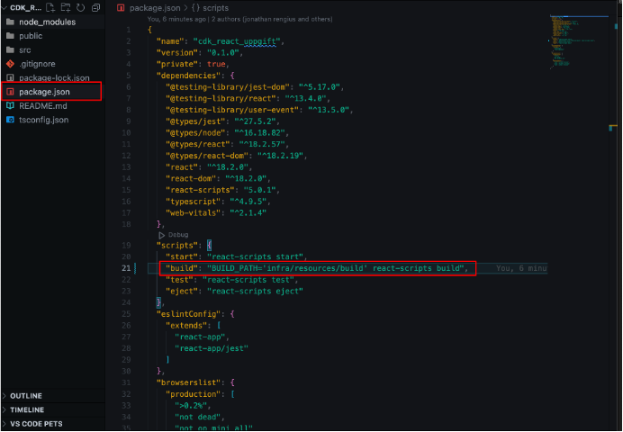
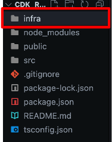
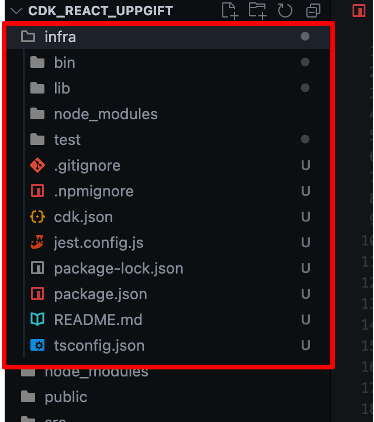
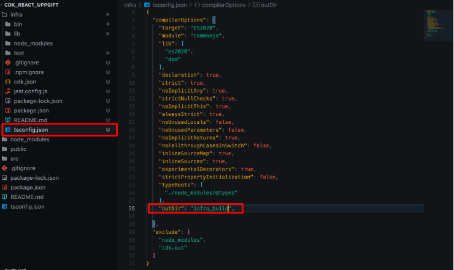
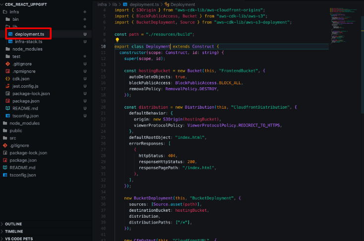
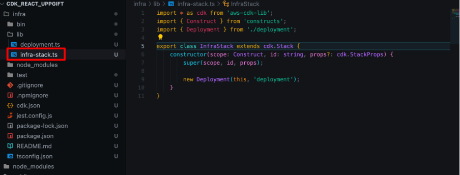
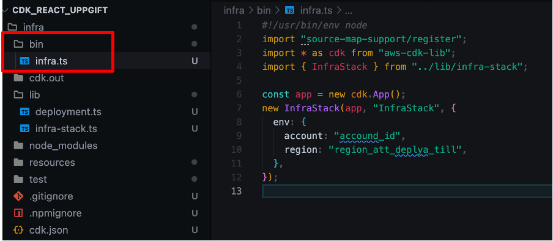
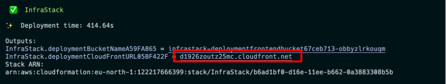
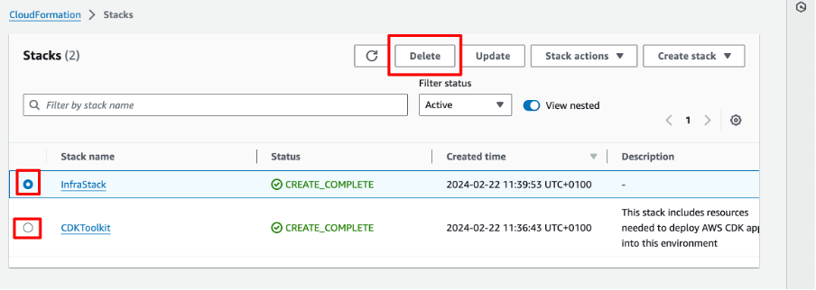

# CDK frontend-app med TypeScript

### Ni kan använda andra språk men då får ni mindre hjälp av mig

Målet med uppgiften är inte att ni ska lära er React. Detta är bara för exempel så att ni har något att deploya. Vill ni bygga en roligare frontend är ni välkomna att göra det 😀

## Förberedelser

- Kolla denna video för att uppfirska er förståelse av CDK: [CDK intro](https://www.youtube.com/watch?v=nlb8yo7SZ2I)
- Läs igenom pre req för CDK:
  [pre req](https://docs.aws.amazon.com/cdk/v2/guide/getting_started.html#getting_started_prerequisites).

#### TL;DR

- Se till att node 14.15.0 eller senare är installerat på datorn.
- npm -g install typescript
- Sätt upp [AWS CLI](https://aws.amazon.com/getting-started/guides/setup-environment/module-three/) och [CDK Toolkit](https://docs.aws.amazon.com/cdk/v2/guide/cli.html)
- [aws configure video](https://www.youtube.com/watch?v=dZgLNL869YU&t=26s)

## Skapa er React app

- Skapa en ny mapp på valfri plats -> `mkdir cdk_uppgift`
- Gå in i er nya mapp -> `cd cdk_uppgift`
- Kör: `npx create-react-app cdk_react_uppgift --template typescript`
- Gå in i er nya mapp -> `cd cdk_react_uppgift`
- Öppna er React app i en editor. Jag använder VS Code. Kortkommando för att öppna projektet i VS code från terminalen är: `code .`

  - Väl inne i projektet behöver vi uppdatera vart det kompilerade projektet ska sparas. Detta görs i package.json. Lägg in detta under scripts: ` "build": "BUILD_PATH='infra/resources/build' react-scripts build"`

    

## Initiera CDK

- I roten av projektet behöver vi nu skapa en mapp där vår infrastruktur ska ligga -> skapa en mapp som heter infra

  

- Nu går vi in i infra mappen -> `cd infra`
- Här behöver vi initiera en CDK-app -> `cdk init app --language typescript`
- Då borde ni ha något som ser ut såhär:

  

- För att samla alla kompilerade filer som kommer när vi senare bygger projektet kan ni uppdatera tsconfig.json inuti infra-mappen med en out directory: `"outDir": "infra_build"`

  

- Inuti Infra-mappen går ni in i mappen lib. Här skapar ni en ny fil som heter deployment.ts och lägger in följande kod:

```javascript
import { Construct } from "constructs";
import { CfnOutput, RemovalPolicy } from "aws-cdk-lib";
import { Distribution, ViewerProtocolPolicy } from "aws-cdk-lib/aws-cloudfront";
import { S3Origin } from "aws-cdk-lib/aws-cloudfront-origins";
import { BlockPublicAccess, Bucket } from "aws-cdk-lib/aws-s3";
import { BucketDeployment, Source } from "aws-cdk-lib/aws-s3-deployment";

const path = "./resources/build";

export class Deployment extends Construct {
  constructor(scope: Construct, id: string) {
    super(scope, id);

    const hostingBucket = new Bucket(this, "FrontendBucket", {
      autoDeleteObjects: true,
      blockPublicAccess: BlockPublicAccess.BLOCK_ALL,
      removalPolicy: RemovalPolicy.DESTROY,
    });

    const distribution = new Distribution(this, "CloudfrontDistribution", {
      defaultBehavior: {
        origin: new S3Origin(hostingBucket),
        viewerProtocolPolicy: ViewerProtocolPolicy.REDIRECT_TO_HTTPS,
      },
      defaultRootObject: "index.html",
      errorResponses: [
        {
          httpStatus: 404,
          responseHttpStatus: 200,
          responsePagePath: "/index.html",
        },
      ],
    });

    new BucketDeployment(this, "BucketDeployment", {
      sources: [Source.asset(path)],
      destinationBucket: hostingBucket,
      distribution,
      distributionPaths: ["/*"],
    });

    new CfnOutput(this, "CloudFrontURL", {
      value: distribution.domainName,
      description: "The distribution URL",
      exportName: "CloudfrontURL",
    });

    new CfnOutput(this, "BucketName", {
      value: hostingBucket.bucketName,
      description: "The name of the S3 bucket",
      exportName: "BucketName",
    });
  }
}
```



Vi skapar denna fil för att följa AWS best practice som säger att man ska bygga en Construct som kan återanvändas. [best practice](https://docs.aws.amazon.com/cdk/v2/guide/best-practices.html)
Notera att vi sätter upp vår path till den byggda React-appen.

- Nästa steg är att kalla på vår deployment fil inuti vår infra-stack.ts. I mappen lib öppna filen infra-stack.ts och ersätta koden med detta:

```javascript
import * as cdk from "aws-cdk-lib";
import { Construct } from "constructs";
import { Deployment } from "./deployment";

export class InfraStack extends cdk.Stack {
  constructor(scope: Construct, id: string, props?: cdk.StackProps) {
    super(scope, id, props);

    new Deployment(this, "deployment");
  }
}
```



- Sista steget är att uppdatera infra.ts i bin mappen med detta:

```javascript
#!/usr/bin/env node
import "source-map-support/register";
import * as cdk from "aws-cdk-lib";
import { InfraStack } from "../lib/infra-stack";

const app = new cdk.App();
new InfraStack(app, "InfraStack", {
  env: {
    account: "accound_id",
    region: "region_att_deplya_till",
  },
});
```



## Deploy

- Se till att ni står i roten av projektet och kör: npm install && npm run build för att bygga React appen.
- Gå in i er infra mapp -> `cd infra`
- Kör `cdk bootstrap` för att förebereda er miljö
- Kör `cdk synth` för att testa och se er cloudformation config
- Kör `cdk deploy` för att deploya er kod. (Ni kommer få en fråga om ni vill godkänna. Skriv då y för att godkänna deployment)
- När er deployment är klar kommer ni se en URL som output:

  

  - Kopiera den och klistra in i er webläsare för att testa.

## Efter Deploy

- Se till att radera alla era resurser när ni är klara:

  
